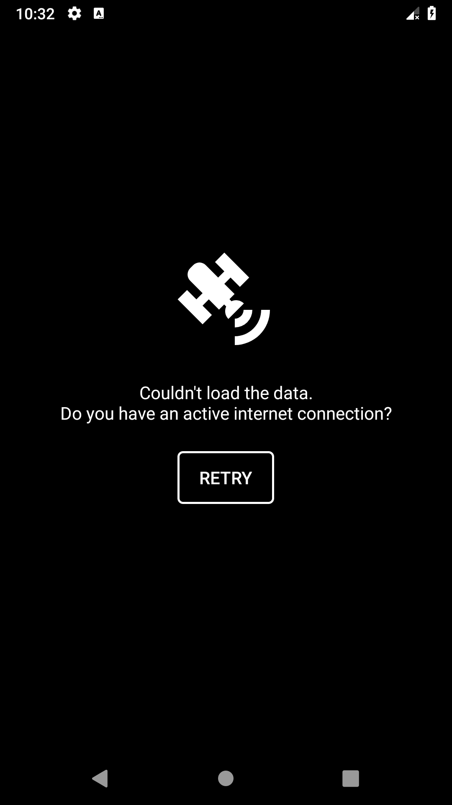
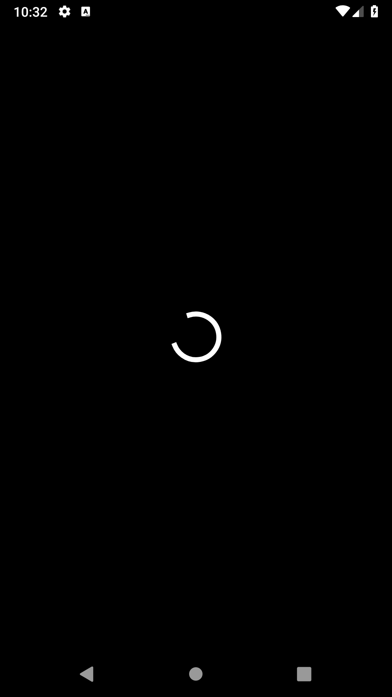
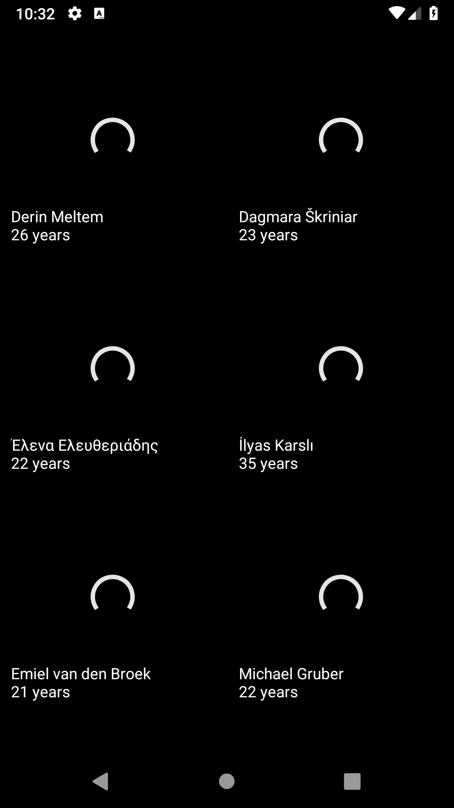
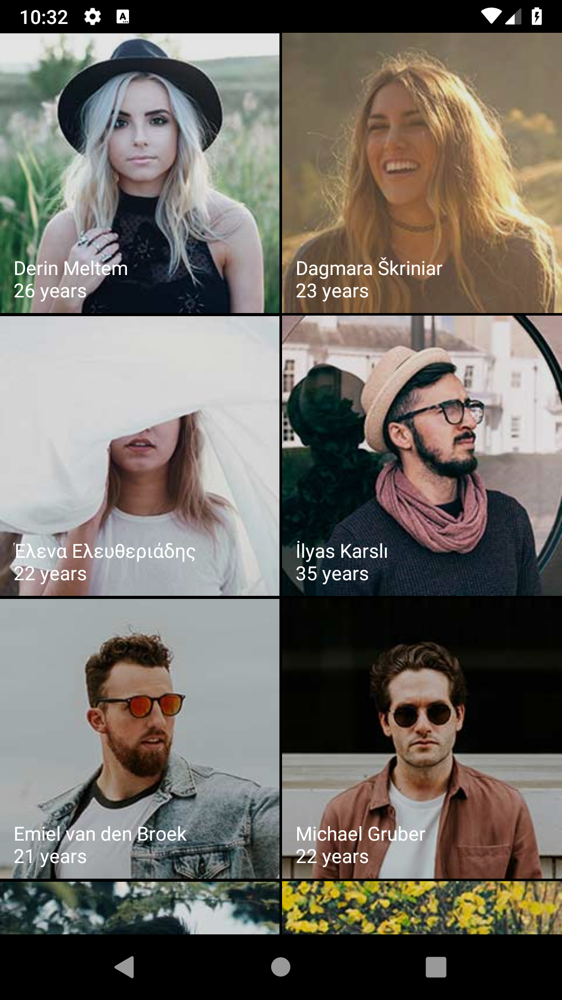
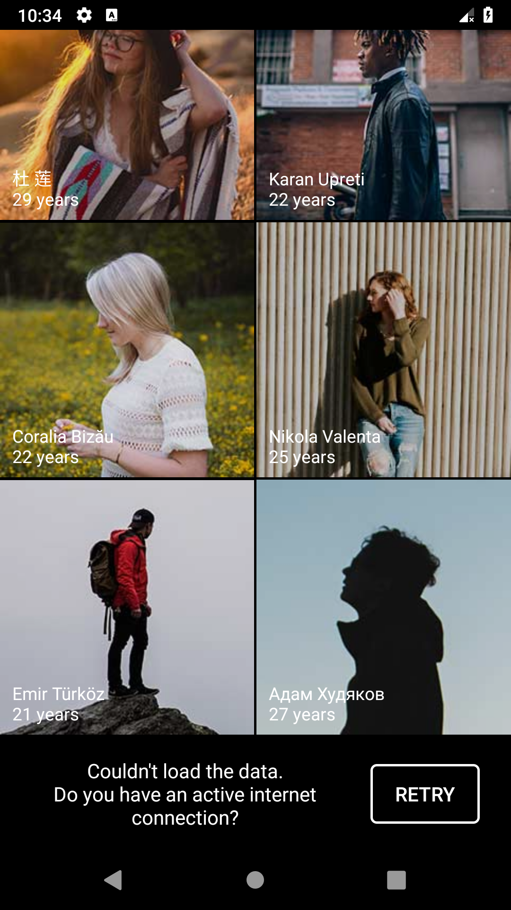
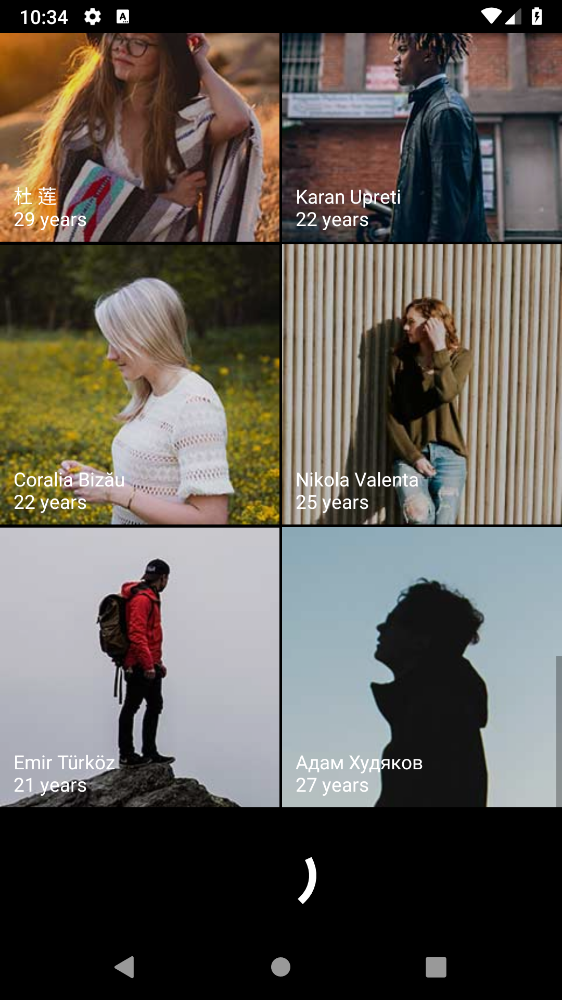

# People Demo
An Android demo application fetching, saving and displaying people from the https://uinames.com API.

### Features:
- fetches people in groups of 10 from the API
- saves the received group in a database
- displays the people in a grid
- when tapping on a person transitions to a full screen view of that person
- handles loading and error states gracefully
- provides an easy way to write unit/integration/UI tests

| | | | |
:-------------------------:|:-------------------------:|:-------------------------:|:-------------------------:
 |  |  | 
 |  |  |

### Uses:
- Kotlin
- MVVM combined with the Clean Architecture principles, implemented with RxJava2
- Dagger2 for dependency injection
- Retrofit2 for networking
- Room to save the people in a database
- Glide for image handling
